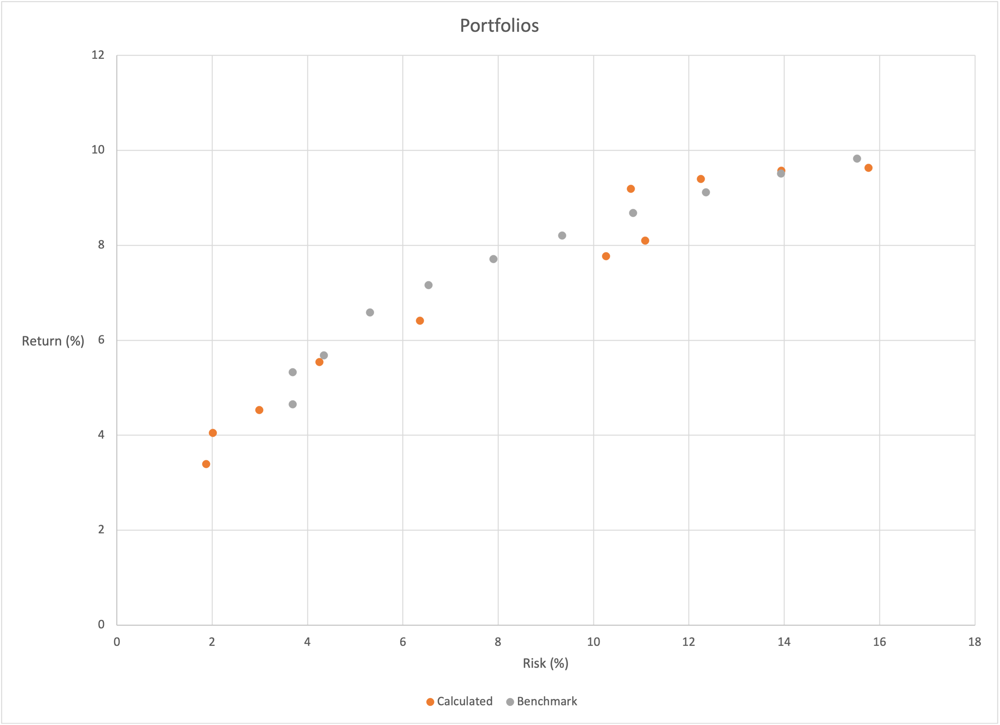

import AssetClassStats from '~/components/tables/AssetClassStats.vue'
import AssetClassStatsRanked from '~/components/tables/AssetClassStatsRanked.vue'
import AssetClassWeights from '~/components/tables/AssetClassWeights.vue'
import AssetClassStatsAveraged from '~/components/tables/AssetClassStatsAveraged.vue'
import AssetClassCorrelation from '~/components/tables/AssetClassCorrelation.vue'
import AssetClassAllocations from '~/components/tables/AssetClassAllocations.vue'
import FundSelection from '~/components/tables/FundSelection.vue'
import AssetClassPortfoliosRiskReturn from '~/components/tables/AssetClassPortfoliosRiskReturn.vue'

It can be tricky to determine the perfect asset allocation for you investment portfolio. I'm sorry to say, there probably isn't one. However, there are some guidelines you can follow to get you pretty close. Let's start by looking at three factors to consider that will inform you allocation decision.

## Factors to Consider
You determine your asset allocation by three closely-related factors: risk tolerance, time horizon, and goals.

**Risk Tolerance**
All investment portfolios carry risk. However, you can mitigate that risk to varying degrees, and risk tolerance is the amount of risk you are willing to carry in your portfolio.

**Time Horizon**
You are investing for a reason: you will need money in the future that you do not need now. The time horizon is the period until you need that money.

**Goals**
People invest to achieve different goals. The two most common goals are retirement and a paying for a house downpayment. Goals factor when you need your money, which affects how much risk you can tolerate.

These are all important to consider. If you need your money sooner because of one of your goals, you will likely have a lower tolerance to risk. However, you probably have a much higher risk tolerance if you don't need your money for 40 years. Your general viewpoint of money and financial biases impact these factors. You may be a risk-taker who is not concerned with financial security. Likewise, you could be extremely careful with your money, not wanting to spend it on anything. Therefore, your mindset has a role to play here. Take some time to consider these factors and determine the level of risk you are willing to take.

## Calculating a Portfolio Allocation
How do you take the three factors (risk tolerance, time horizon, and goals) and turn them into a portfolio? First, look at the three portfolios you need and pick the best one using those factors.

### The Only Portfolios You Will Ever Need
There are three phases of your investing life. You may switch back and forth between them several times, but you will use the same portfolios each time you return to a phase.

**Wealth Accumulation**
There are likely going to be times when you want your portfolio to grow. Some examples could be you have not retired yet, you are saving for a house downpayment, or you are returning to work.

**High-Yield**
High-yield is when you don't have income and live on a reserve fund. It would help if you increased your portfolio yield to increase your capital.

**Wealth Preservation**
You have met your goal, and now you need to hold onto your money for as long as possible.

We will be returning to these portfolios later on. As we progress through our calculations, consider how the portfolio best suits you and fits into the equation.

### Calculate the Risk and Return of Asset Classes
This section will explain a series of calculations I made to develop diversified portfolios for various goals. I found that this exercise was largely unnecessary. You can create an excellent portfolio with only two asset classes: the total U.S. bond market and the total U.S. stock market. Continue to see how I came to this conclusion, or skip this section to see how to apply my findings.

[PortfolioVisualizer](https://www.portfoliovisualizer.com) is a website that hosts many helpful tools for building portfolios. Using the [Backtest Portfolio Asset Class Allocation](https://www.portfoliovisualizer.com/backtest-asset-class-allocation) tool, I calculated the risk and return of many key asset classes. While the data can go back to 1972, not every asset class is available that far back, so I used the tool multiple times to get as many asset classes as possible on various timeframes. For the return, I used the compound annual growth rate, or CAGR, an investment's mean yearly growth rate over a specified time longer than one year. For the risk, I used the standard deviation, a measure of volatility. The standard deviation is the average amount by which individual data points differ from the mean; in other words, it is the spread of an asset's price from its average price. If the standard deviation is high, the asset's price is more volatile and, therefore, risky. Below is a table of each asset class's CAGR and Standard Deviation for various periods.

<AssetClassStats />

For each period, I rank each asset class as a decimal number between 0 and 1, representing its relative position in the distribution in asset class CAGRs. So, the asset with the highest CAGR would be a 1, whereas the lowest would be a 0. The class with the median CAGR would be 0.5. I then did the same for the standard deviation but inverted it because the lower standard deviations are better. So, a slight standard deviation would have a higher rank. Below is a table with each asset class's position.

<AssetClassStatsRanked />

Then, I took the average of its CAGR rank and standard deviation rank for each asset class in each period. Below is a table with the average positions.

<AssetClassStatsAveraged />

Next, I created a table with columns counting by tens from zero to one hundred. So there is a column for 0, 10, 20, 30, and so on. I am using these numbers as weights to apply to the ratio of each asset class's CAGR and standard deviation. This way, I would have a score combining the characteristics of each column. For example, a 20 would add the CAGR score to the standard deviation score by multiplying the standard deviation by 20% and the CAGR by 80%. Below is a table with those results.

<AssetClassWeights />

I separated the asset classes into five groups: gold, REITs, bonds, international stocks, and U.S. stocks. Gold consistently underperformed, so I disregard that one. For each weighting, I selected each group's highest scoring asset class. For example, at a weighting of 10, I selected U.S. mid-cap stocks for the U.S. stocks group and International ex-US Small Cap for the international stocks group. The bond group is the least volatile, so I created weighted portfolios with one side being bonds and the other being everything else. I weighted the asset classes in the "everything else" group by their scores. For the 10-weight group, U.S. stocks scored 0.93, international stocks scored 0.67, and REIT scored 0.68. I took the category weighting, 90%, and divided it between the three asset classes, weighted according to their score. This calculation gave me the following results:

* bonds: 0.1
* U.S. stocks: 0.37
* International stocks: 0.26
* REIT: 0.27

The following table shows this calculation for each asset class of each weighting.

<AssetClassAllocations />

I used the portfolio backtest tool again, plugging in the weights for each asset class. I also did this by weighting the US Stock Market and Total US Bond Market as benchmarks. Below are the results from data going back to 1995.

<AssetClassPortfoliosRiskReturn />

Finally, I generated a scatter plot to show the risk/return for each portfolio.

As you can see, the benchmark was close to or outperformed the more diversified portfolios, which leads me to believe that diversification can be helpful but is unnecessary. That is fine if you want a more diversified portfolio to smooth out your returns and mitigate risk. But I do not think it is critical to do that, and it seems it would be most helpful for low-risk portfolios.

Another thing to note is that a 70/30 is very close to 100/0 in its return (88%) while being much less risky (70%). 100% stocks offer the greatest return and are an excellent option if you are in the wealth accumulation phase. However, if you are concerned with risk, adding 20% to 30% bonds can reduce your risk significantly. If you are not in the wealth accumulation phase, I would have a minimum of 30% bonds. I would use the chart corresponding table to decide on a risk level that you are comfortable with that also maximizes your returns.

## Fund Selection
Once you have decided on an allocation, you need to figure out which funds get you there. Your dependence on high-yield assets will determine part of the decision, as they usually come with higher fees. If you have a small portfolio or are not concerned with yield, select the funds that cover your asset classes with the lowest costs.

There are many resources online to help you find the exact funds to meet your needs; however, there are a few that I would recommend. Below is a table with several options.

<FundSelection />

Here are a few examples to get you thinking:

**Single-Asset Growth**
The most simple portfolio you can have is a single ETF, a 100% stock portfolio. If you are focused on growth and do not care about risk, put everything in VTI, and this offers excellent return potential for meager costs.
* 100% VTI

**Two-Asset Moderate Risk**
Let's assume you are going for a 70/30 portfolio to mitigate risk. That would look like this:
* 70% VTI
* 30% BND

Backtesting this from 2011 gives a CAGR of 9.04% and a Standard Deviation of 10.19%.

This portfolio would give you a yield of 2.11%.

**Two-Asset High Yield**
If you like that 70/30 blend, but you want to increase your yield temporarily, you could switch your assets around:
* 70% VYM
* 30% VCIT

This portfolio would raise your yield to 3.55%.

Backtesting this from 2011 gives a CAGR of 9.14% and a Standard Deviation of 9.48%.

If you switch VCIT for PGX, accepting the high expense ratio, you can increase your yield to 3.85%. However, you can improve it by increasing your allocation to PGX. Let's say you do 50/50. That's great! Now your yield is 4.39%. However, your CAGR drops to 8.17%. If you replace 15% of VYM with QQQ (low yield, high return), your CAGR rises to 9.19%, and your yield drops to 4.16%.

While a portfolio like this would increase your risk over the VTI/BND portfolio, it may be worth it to you in the short term.

**4-Asset Growth**

If you are okay with higher risk but do not feel comfortable with 100% VTI and would rather have something in between that and the VTI/BND portfolio, the following is an excellent in-between option.
* 33% IMCG
* 24% VEA
* 23% USRT
* 20% VGLT

This portfolio would give a yield of 2.51%.
Backtesting this from 2011 gives a CAGR of 7.9% and a standard deviation of 11.24%. A lower CAGR and high standard deviation is the cost you pay by adding diversity.

### A Few Comments on Fund Selection
Fund selection can become a game, trying to switch things around to get the best projections. The problem is that history can only help us guess what will happen. Nothing is guaranteed. Basing your decision entirely on past performance may not work out as the past is not necessarily an indicator of what is to come.

It is easy to try to be clever and outsmart the market. Still, that goal is challenging to achieve, and it usually ends in people losing money or, at the very least, ending up with suboptimal returns. The more simple your portfolio is, the better. There is nothing wrong with sticking to one or two ETFs and moving on with your life: set it and forget it, as they say.

Adding in international assets makes sense for diversity. No one would blame you for doing that, and many financial advisors recommend it. It is probably not necessary, though. The thought is that if the U.S. market is down, another economy may be up. While, in theory, this makes sense, many economies are more tied to the U.S. than you think. Also, many of the biggest companies in the U.S. market are international. By investing in them, you are still getting international exposure. There is also more risk and smaller returns in global assets, so you must decide what the added diversity is worth.

Finally, switching your portfolio around and chasing the best returns may incur additional brokerage fees and have negative tax implications. It is best to make a selection and stick with it until it is time to rebalance your portfolio.

### Application
An ideal portfolio is composed of two funds, VTI and BND. Holding more funds for diversification is unnecessary, and it diminishes results. Based on the current phase of your investment life, determine a tolerable percentage of your portfolio to hold the riskier fund VTI and put the remaining amount in the low-return, low-risk BND fund.