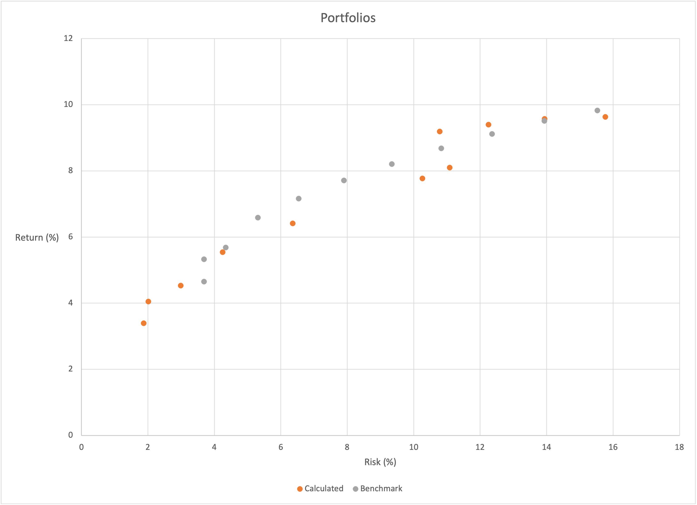

import AssetClassStats from '~/components/tables/AssetClassStats.vue'
import AssetClassStatsRanked from '~/components/tables/AssetClassStatsRanked.vue'
import AssetClassWeights from '~/components/tables/AssetClassWeights.vue'
import AssetClassStatsAveraged from '~/components/tables/AssetClassStatsAveraged.vue'
import AssetClassCorrelation from '~/components/tables/AssetClassCorrelation.vue'
import AssetClassAllocations from '~/components/tables/AssetClassAllocations.vue'
import FundSelection from '~/components/tables/FundSelection.vue'
import AssetClassPortfoliosRiskReturn from '~/components/tables/AssetClassPortfoliosRiskReturn.vue'

It is essential to know how to manage your portfolio. Even if someone does it for you, it helps to understand why the manager makes their decisions. People often view portfolio management as some mystical practice that you can do only after many years of school. Financial advisors make money by convincing people that managing their investments is too complex. This claim is not valid, though. Anyone can do it.

Constructing a sound portfolio can seem daunting. Do you go out and buy a stock? Which one? What if that stock fails? What if the stock market crashes? Should you instead split your money between multiple assets? How do you know which investments to choose? What percentage of your portfolio should go to each purchase? These are difficult questions to answer. And it is understandable to feel scared and overwhelmed trying to answer them. But they don't need to be scary. There are answers to these questions that you can figure out on your own.

## Robo-Advisors
Before we start looking at portfolio construction, let's take a quick look at an alternative to a financial advisor that does not require you to manage everything yourself. Managing your portfolio is a great skill; it puts you in control of your finances and gives you confidence that your money is where it should be. However, it is time-consuming. Once you have put in the time to determine the best funds to buy and make your purchases, you will need to return to your portfolio and make adjustments periodically. You do most of the work upfront, but you must review your portfolio and make adjustments every 6-12 months.

An alternative is to use a Robo-advisor. The two most popular tools are [Wealthfront](https://wealthfront.com) and [Betterment](https://betterment.com). These are digital platforms that provide algorithm-driven financial planning services. The application will request various details from you to determine the best way to invest your money to meet your goals. You set up an account and fund it; then, the platform will purchase investments according to your specifications for a small fee. While this is more expensive than managing your portfolio, it is much cheaper than paying a financial advisor. I have used Betterment. It is a solid application I would recommend to anyone who does not want to control everything. If you want to save money on financial services and have greater control over your finances, read on to learn how portfolio construction works.

## What is Asset Allocation
Asset allocation is the specific distribution of asset types in your investment portfolio. When investing, you are spending money on things you hope will increase in value, which you will sell later. These "things" are assets. There are several different types of assets, or asset classes, each having two primary characteristics you care about: risk and return. While you are hoping your investments will increase in value, there is a possibility that they will instead decrease in value. This possibility is the risk the asset carries, whereas the change in the asset's value is its return. The ratio between an asset's risk and return is crucial to understand. The goal of optimizing this ratio, maximizing the returns while minimizing risk, is achieved using diversification.

## Diversification
As a general rule, different asset classes offer various risks and returns; the greater the chance of an asset's failure, the greater its potential return. While everyone wants huge returns, going after them may result in huge losses. Targeting low-risk holdings while avoiding the losses of high-risk assets will significantly limit the upside potential. The way to achieve something in between is to invest part of your portfolio in high-risk investments and low-risk assets. This practice is diversification. Let's look at which types of investments are available to you.

## Asset Classes
Before you can start dividing up your money, you need to know where you can put that money. There is a wide range of asset classes. There are two primary ways to categorize asset classes: type and function. For example, you can group all asset classes related to stocks together as "equities," or you can put growth stocks into a "growth" category and your dividend stocks (stocks that pay you money for holding them) into an "income" category. Both categorization methods are helpful. So we will start by looking at the asset classes from a broader perspective, the general types. Then we will look at them in more detail, categorized by function.

### General Asset Classes
There are four primary asset classes, each comprising various asset types or subclasses.

#### Defensive Assets
Defensive assets are securities that you can easily convert into cash. These investments include cash and cash equivalents, money market funds, U.S. Treasury bills, certificates of deposits (CDs), bank checking accounts, and savings accounts. These offer the highest level of stability, liquidity, and flexibility, and they also provide the lowest returns.

#### Equities
Equities are also known as stocks. They are portions of ownership in a company, and each piece is called a share. A wide range of factors can impact equity's growth. Equities have a higher potential return than the other asset classes; however, they also carry greater risk. In addition to increasing in value, many stocks also provide dividends. These are rewards a company pays its shareholders for investing in the company.

#### Fixed Income
Fixed-income securities are loans that are broken into units and sold. Investors provide the capital for a specific number of loan parts and receive interest payments on the provided money. These securities, also known as bonds, have a predetermined maturity date at which the agency that took the loan repays the principal capital. Bonds can provide money to the government as well as corporations. These securities provide a predictable income. While they have slightly more volatility than cash and slightly greater returns, they are generally considered safe investments.

#### Alterative Investments
Finally, we have the asset class that encompasses all other types of securities. Examples of alternative investments are real estate, precious metals, cryptocurrency, digital assets, art, and peer-to-peer loans, which carry a wide range of risks and returns.

### Specific Asset Classes
Within these asset classes are several types of assets. When researching diversification, you frequently see people expressing their portfolio as a ratio of stocks to bonds. Even if you stick exclusively to these asset classes (equities and fixed-income), how do you know which stocks and bonds to purchase? Let's break the asset classes into smaller collections of assets that we can group by function to help identify which to buy and how to use them.

#### Defensive
Defensive assets are investments we expect to underperform when the stock market rises. However, these assets have a low, and sometimes inverse, correlation with the stock market. That means that moves in the stock market have little impact on defensive assets. If the stock market is under pressure, it may not affect the assets or perform better. These are not guaranteed to preserve your capital; however, they are the safest way to protect it and limit volatility.

**cash and cash investments** offer the highest stability, liquidity, and flexibility. They are most helpful if you need your money soon and offer meager returns that change with interest rates and inflation. Examples are checking accounts, savings accounts, certificates of deposits (CDs), cash in brokerage accounts, and money in a purchased money fund.

**U.S. Treasury Securities** such as Treasury notes and Treasury bonds are highly safe and among the highest credit-quality investments available. They pay interest, and the U.S. government backs their principal and interest payments. They come in various maturity ranges, so they can provide diversity and security to a portfolio while allowing the opportunity to use that money at a specific time.

**International Developed-Country Bonds** offer geographic and currency diversification and income potential. They are more volatile than U.S. Treasury securities but remain stable and defensive.

**Gold and Other Precious Metals** are used to protect against sharp declines in the stock market or extreme cases of inflation. Financial system instability often results in investors buying gold. While the assets are defensive, they still have price volatility and are a terrible option if you need cash at a specific time.

#### Inflation Protection
Inflation protection is a method to diversify your portfolio and minimize the negative impact inflation can have on the value of your portfolio. These investments are not guaranteed to beat inflation but offer protection against it, and they may decrease in price if deflation occurs.

**U.S. Inflation Protected Bonds** are Treasury Inflation-Protected Security (TIPS) and are used to protect against rising inflation. When the bonds mature, they pay the greater of the original principal and the inflation-adjusted principal.

**Commodities** are great for diversification. Commodities such as energy, agriculture, industrial metals, and livestock protect against inflation. They are not purchased independently; instead, an investor purchases mutual funds or exchange-traded funds for them. These funds will buy and sell agreements to purchase a specific amount of the commodity at an agreed-upon date and price. The arrangements are called futures contracts.

#### Income
Income-oriented assets, fixed-income investments, provide a predetermined amount of money. The fixed-income assets are much less volatile in value than growth assets. The steady income stream they provide is considered safe and can help add stability to a portfolio. They are, however, not entirely risk-free. Despite these assets' consistent income, they can still decline in value.

**International Emerging-Market Bonds** come from governments and companies in emerging markets (markets that are still developing). These bonds offer the potential for capital appreciation and come with more significant risk factors associated with emerging markets, such as political instability and currency fluctuation. Higher yields compensate for the risk factors.

**Preferred Stocks** are a hybrid of stocks and bonds. A company issues them to raise money; therefore, they are not a vehicle of ownership like a common stock. While functioning more like a bond, people trade them on the stock market as common stocks. The primary downside to preferred shares is that "preferred" shareholders get paid after bonds in the event of a default. However, they get paid before common shareholders. A higher yield compensates for this downside. An equity index has a 2 percent yield, whereas preferred shares are commonly between 4 and 6 percent. Since their volatility also sits between bonds and stocks, investors can use them to increase results while mitigating some of the risks of common stocks.

**Bank Loans** are loans made by banks. They are not made for retail investors, however, but for commercial borrowers. Companies sell the loans to investment vehicles, mutual funds, and exchange-traded funds. Because the loans pay interest, the funds will pay a floating rate based on a short-term interest rate benchmark. Investors can use these floating rates to hedge against interest rate changes, so many investors buy them for income.

**U.S. High Yield Corporate Bonds** are bonds that offer higher yields than comparable investment-grade bonds. However, they are much riskier because companies issue them with low credit ratings.

**U.S. Investment-Grade Corporate Bonds** are issues by U.S. companies with relatively high credit ratings. These debt securities offer higher yields than U.S. Treasury bonds of comparable maturity. However, they provide lower results compared to high-yield corporate bonds.

**U.S. Securitized Bonds** are debt securities that hard assets or loans support. These include asset-backed securities (ABS), mortgage-backed securities (MBS), and commercial MBS.

**Investment-Grade Municipal Bonds** are generally government bonds issued by local governments smaller than a country, such as cities, states, counties, and public purpose entities (like hospitals and airports). They have a high credit rating and are exempt from federal taxes.

#### Growth and Income
Some asset classes that provide steady income opportunities also have the potential to grow in value, having both high yield and high returns. These classes come with more risk than income-focused asset classes and less risk than growth-oriented classes.

**U.S. High Dividend Stocks** are shares of U.S. companies. What makes these unique is their higher-than-average dividend distribution to their shareholders.

**International High-Dividend Stocks** provide the dividend potential of U.S. High Dividend Stocks but with added diversification to a portfolio by relying on markets independent of the U.S. market.

**U.S. Real Estate Investment Trusts (REITs)** are corporations that own and manage real estate. They are not holding the real estate with the expectation that it will increase in value. Instead, they own and operate these investments to rent them out to tenants. The real estate could be office buildings, shopping malls, nursing homes, apartment complexes, etc. REITs purchase these properties and hire people to manage them. They find tenants for the properties and pass the rent collected to their shareholders. The purpose of REITs is to provide income to shareholders. Therefore, they can offer a higher yield than the stock market.

** International Real Estate Investment Trusts (REITs)** are REITs in countries outside the U.S., providing diversification, income potential, and protection against inflation.

**Master Limited Partnerships (MLPs)** are publicly traded securities of partnerships. They generate 90% of their income from the production of commodities, oil, natural gas, coal, and activities related to real estate. They offer a tax advantage because cash flows at the company level are not taxed.

#### Growth
Of all asset classes, the highest returns come from stocks. Therefore, when the primary focus of your portfolio is growing, it should have a high percentage of stocks. Equities also have the highest volatility and hence, the highest risk of all asset classes.

**U.S. Large-Company ("Large-Cap") Stocks** are shares which U.S.-based companies with a market capitalization of more than $20 billion issue. They are the most liquid (possessing a high availability of buyers) stocks and generally the most stable.

**U.S. Medium-Company ("Mid-Cap") Stocks** sit between small-cap and large-cap stocks. They are shares issued by U.S.-based companies with a market capitalization of less than $20 billion and more than $2 billion. Their level of risk and return generally sits in a range between large-cap and small-cap stocks.

**U.S. Small-Company ("Small-Cap") Stocks** are shares which U.S.-based companies with a market capitalization of less than $2 billion issue. Small-cap stocks have more room to grow when compared to large-cap stocks, so they have more significant potential for high returns. However, they also have equally high volatility.

**International Developed Large-Company ("Large-Cap") Stocks** are large-cap stocks issued by companies in highly economically developed countries. These provide growth potential similar to that of their U.S. counterparts. The benefit they provide is that the companies are part of an economic system separate from U.S. stocks. Their revenue is much more closely related to their home country's economy. If the U.S. market is doing poorly, that does not necessarily mean the foreign economy is also down, which provides an additional layer of diversification while maintaining the benefits of large-cap stocks. International investments carry additional risk due to several factors they are subject to that U.S. stocks may be less affected by, such as currency fluctuations and political instability.

**International Developed Medium-Company ("Mid-Cap") Stocks** are the international equivalent of U.S. mid-cap stocks. They provide the same benefits as the U.S. stocks while providing additional diversification like the global large-cap stocks.

**International Developed Small-Company ("Small-Cap") Stocks** are issued by small-cap companies in developed markets. Like small-cap U.S. stocks, they offer excellent growth potential and provide diversification to portfolios already containing U.S. small-cap stocks.

**International Emerging-Market Stocks** are issued by companies whose markets are still developing. Developing economies can grow much faster than developed economies because they have much more room to grow. Stocks of companies in developing economies, therefore, can grow much faster. They come with greater risk, though, and they also provide the diversification of a market that performs differently than that of developed markets.

## Correlation and the Importance of Diversification
With a better understanding of what asset classes are available, it is essential to know how they interact with each other. Some asset classes are more tightly-coupled than others. If one asset class changes in value and another asset class frequently mirrors that change, they have a high correlation. If the two asset classes move independently, they have a low correlation. When one asset class moves up, and another often moves down, they are negatively correlated. An example of a negative correlation would be stocks and bonds. Bonds often grow most when the stock market is down, and they grow least when it is up.

Correlation is significant to consider when choosing an asset allocation. The best way to mitigate risk is by investing in multiple asset classes. But, if those classes are closely correlated, the added diversity may be helping less than you want. To limit risk, you should have the most significant portions of your portfolio have the most negligible correlation.

Below is a table with a set of indices and their correlations with each other. An index is just a group of assets of a specific type. This table will help see how asset classes are correlated. The closer the value is to one, the greater the correlation is between the asset classes.

<AssetClassCorrelation />

## Index Mutual Funds and ETFs
Before looking at the specifics of picking an appropriate allocation, let's look at how even to acquire assets. Most assets, such as equities, can be purchased individually on the open market. Since the most remarkable growth comes from stocks, you should have some in your portfolio. However, equities have excellent upside potential and significant risk associated with them. What if you buy shares of a company and that company goes bankrupt? What if the stock value goes to zero? These are legitimate concerns. Stocks do fail sometimes. A better approach would be to buy shares in many different companies. How many? How diverse should your portfolio be? What if you pick five stocks, and they all fail? The solution to these concerns is investing in large market segments or the entire market. While equities may fail and sectors of the stock market may fail, the market in its entirety will not go to zero. As I'm sure you are aware, the market has crashed before. Several times it has dropped by significant amounts. Every time, however, it has come back. After a substantial crash, the average time it takes to return to its previous level is two years. The longest it has ever taken is five years. It always comes back. So, investing in a stock or even a handful of equities is risky. Investing in the stock market is significantly safer, which, on average, returns between 8% and 12% every year.

How do you invest in the stock market as a whole? By using funds with that specific purpose. Exchange-Traded Funds (ETFs) and Mutual Funds are pools of individual securities, such as stocks and bonds. Their goal is to offer exposure to various assets and increase diversification. An index is a broad representative portfolio of investment holdings. Institutions construct indices differently, but they are generally weighted lists of stocks that make up a hypothetical portfolio. You cannot invest in indices themselves. However, ETFs and mutual funds (index mutual funds) track them. When selecting your asset allocation, for each asset class you choose, there are representative indices for them. You will invest in these to diversify your portfolio and protect yourself from significant drops in individual stocks.

ETFs and mutual funds are very similar. Mutual funds generally have more fees because fund managers actively manage them. ETFs, generally, are passively managed, just tracking an index. Investors trade ETFs like stocks on the open market, making them easier to buy with a lower barrier to entry. Also, ETFs are generally more tax efficient. Both are good options, but most people try to stick to ETFs.

## Determining Your Portfolio Allocation
With a solid understanding of asset allocation, diversification, and investment vehicles, it is time to calculate your portfolio allocation. There are many ways to diversify your portfolio, and I will discuss one method here; hopefully, that can give you ideas of what will work for you.

## Factors to Consider
You determine your asset allocation by three closely-related factors: risk tolerance, time horizon, and goals.

**Risk Tolerance**
All investment portfolios carry risk. However, you can mitigate that risk to varying degrees, and risk tolerance is the amount of risk you are willing to carry in your portfolio.

**Time Horizon**
You are investing for a reason: you will need money in the future that you do not need now. The time horizon is the period until you need that money.

**Goals**
People invest to achieve different goals. The two most common goals are retirement and a paying for a house downpayment. Goals factor when you need your money, which affects how much risk you can tolerate.

These are all important to consider. If you need your money sooner because of one of your goals, you will likely have a lower tolerance to risk. However, you probably have a much higher risk tolerance if you don't need your money for 40 years. Your general viewpoint of money and financial biases impact these factors. You may be a risk-taker who is not concerned with financial security. Likewise, you could be extremely careful with your money, not wanting to spend it on anything. Therefore, your mindset has a role to play here. Take some time to consider these factors and determine the level of risk you are willing to take.

## Allocations by Age
How does your age fit into the calculation? If you are saving for retirement, you need to know how much money you will need and when you want to retire. If you're going to retire at 35, you may take a different strategy than at 65.

As a general guideline, which you will see often suggested, if you plan to retire at 65, you should invest in stocks a percentage equal to one hundred less your age and put the rest in bonds. So, if you are 30 years old, you would put 70% in stocks and 30% in bonds (often written as 70/30). Some people suggest a more aggressive strategy of subtracting your age from 120. In the case of a 30-year-old, you would have a 90/10 stock/bond portfolio.

This strategy might make sense if you plan to retire at 65. However, there are many variables to consider for which this does not factor. This plan leaves out how old you are, how much money you have invested, how much you will receive in retirement from things other than investments, how much your spouse will receive in retirement, and how long your spouse has before retiring. As you can see, this general risk-management guideline is not that helpful. So, how should you allocate your investments?

## How Much Do I Need and When Do I Need It
Most advice on this topic involves determining your risk tolerance and then maximizing your returns given the level of risk you will accept. I think this is backward. How do you know how significant a change of failure you can tolerate? It should be determined by how much money you need and when you need it.

### How Much Money Do I Need To Retire?
Often quoted, though entirely too strict, the figure suggested is 25 multiplied by your expected annual spending in retirement. How do we calculate this number? The Rule of 25, or the 4 Percent Rule, comes from a 1998 paper by three professors of finance at Trinity University detailing their findings in their study of "safe withdrawal rates" from retirement portfolios. They found that an investor who withdrew 4 percent in the first year of retirement and increased their withdrawals in subsequent years to match the increase in the consumer price index (CPI) would have a 95% chance of not exhausting their portfolio in thirty years. This study assumed that a person would retire at 65 and only live an additional 30 years.

Furthermore, it adopted a portfolio with an equal amount of stocks and bonds. The data covered 1925 to 1995 and considered beginning retirement any year. The professors updated the study in 2009, which showed a 96% success rate. This 4 percent number is a fine starting point, but it isn't perfect. There are a few flaws, such as, what if your spending change year to year? What if you want to retire for more than thirty years? What if you do not want a 5% chance of running out of money in retirement? While the data and conclusions of the study may be sound, they make some assumptions that don't apply to everyone.

The Trinity study also revealed that for a 50/50 stock/bond portfolio, $1,000,000 invested after thirty years, taking 4% inflation-adjusted withdrawals, resulted in a median of $2,971,000 remaining in the portfolio. Many times, the study showed, a portfolio would have grown significantly. The study's authors suggest that withdrawing up to 7% is safe if you remain alert and flexible. The key is staying attentive and flexible. The more willing you are to adjust your finances and lifestyle to fit the market, the safer you will be.

If you want to be completely safe, knowing that you have the best chance of your portfolio last well beyond the 30 years used in the study, 3-percent withdrawals, inflation-adjusted, will undoubtedly get you there. That means you need to start with an account size of your living expenses multiplied by 33.34. However, there are other ways to protect yourself and keep the withdrawal rate at 4 percent or even bump it up to 5-6 percent.

In the study, the failing portfolios did not survive because they ran into a market crash within the first five years of retirement. Retire before a vast, 10-year market uptrend, and you'll make money. If a 5-year decline follows this, you have made enough money to weather the storm - you don't care if the market falls; you can wait it out. Remember, the market always comes back. However, what if you retire right before a 5-year decline? Your portfolio would plummet while you are still taking your 4-percent withdrawals. It could be possible that you deplete your portfolio so much that by the time the market turns around, it's too late. This phenomenon is called the sequence-of-return risk. How do you avoid it? By not selling when the market is down.

When you buy stocks in companies, you own a piece of them. Sure, the share price can drop, but the number of shares you have, the percentage of the company you own, cannot. However, if the share price drops and you sell the shares, you have "locked in" those losses. They are never coming back. Your ETFs will return to their original values; eventually, you need to wait for that to happen. When the market is down, it's the perfect time to buy more!

So, how do you hold on to your shares? By keeping some of your money in cash. Store a portion of your money in a high-interest savings account. If the market is downturned, use this reserve fund rather than withdraw from your investments. The median duration of a market crash is two years, with the longest outlier being five years. So, a 5-year reserve fund should be sufficient regardless of what the market does.

Five years of living expenses is a lot of money to save. But you might not need that much. Each ETF has a yield - a monthly or quarterly amount of funds provided by the underlying stock's dividends or the underlying bond interest. Your portfolio, composed of ETFs, therefore, also has a yield. These distributions, if not reinvested, become cash sitting in your investment account, waiting for you to withdraw it. The significance of yield is that it is usually determined when you buy, regardless of how the securities' value changes. So, to figure out how big of a reserve fund you need, subtract your portfolio's annual yield from your yearly spending and multiply that by the number of years you want to reserve. 

Let's look at a hypothetical example. Let's say you stick with a 4-percent, inflation-adjusted withdrawal rate and have annual expenses of $40,000. You will need a portfolio of $1,000,000 ($40,000 x 25). You also need a reserve fund of $200,000 if you want 5-years of protection. If your portfolio has a 2-percent yield, you will get $20,000 annually. Your reserve fund now only needs to be $100,000 = ($40,000 - $20,000) x 5. By using your ETF yield instead of reinvesting it, you cut your reserve fund requirements in half!

> Reserve Fund = (Annual Spending - Annual Yield) x Years of Reserve

What if you wanted to lower your reserve fund even more? You could temporarily shift your portfolio composition to include higher-yielding assets. Look for assets similar to the ones you are targeting for your portfolio with a higher yield. Temporarily switch to these assets. It would be best if you did not do this practice long-term as you need to want your portfolio to be optimized for risk as well. But, it is a great way to protect yourself during your first 5-years of retirement. You can switch to these assets whenever the market is in a downturn and you need to preserve your portfolio.

As long as you have a reserve fund, the 4-percent rule will apply indefinitely. You are no longer limited to 30 years and do not need to worry about being in the 5 percent that fails. Remember that you need to replenish your reserve fund when the market turns back around.

So, back to our question. How much money do you need to retire? I would stick to the 4-percent rule for initial calculations. If there are things you know of that would significantly impact your retirement income, such as social security or a pension, calculate those up and subtract them from your estimated annual living expenses. Multiply the result by 25. Add your reserve fund to this amount. The result is how much you need to retire.

### How Long Until I Can Retire?
Now that you know how much money you need to retire, you might wonder how long it will take to get there. There are a few numbers you will need to calculate this value:
* P - the current principal amount invested
* PMT - the amount you invest regularly
* r - the estimated return rate of your investments (decimal)
* n - the number of times per year you invest (ex. 12 for monthly investments)
* A - The amount you need to retire

Here is the formula you will use:
> years until retirement = (LOG((A + (PMT x 1/(r/n))) / (P + (PMT x 1/(r/n))))/LOG(1+r/n))/n

Plug the numbers into the formula to see how long it will take. You can then play with the numbers a bit. Let's say you start with an estimated return of 0.06. What would happen to the timespan if you calculated your return to be 0.07 or 0.08? What if you increase your monthly deposits by 25%?

This calculation will give you an idea of what returns you will require before you retire to get you to retirement in the necessary amount of time. If you see that 6% returns will let you retire in 30 years and 8% will let you retire in 25 years, you may attempt to adjust your portfolio allocation to get you up to that 8 percent.

## Calculating a Portfolio Allocation
How do you take the three factors (risk tolerance, time horizon, and goals) and turn them into a portfolio? First, look at the three portfolios you need and pick the best one using those factors.

### The Only Portfolios You Will Ever Need
There are three phases of your investing life. You may switch back and forth between them several times, but you will use the same portfolios each time you return to a phase.

**Wealth Accumulation**
There are likely going to be times when you want your portfolio to grow. Some examples could be you have not retired yet, you are saving for a house downpayment, or you are returning to work.

**High-Yield**
High-yield is when you don't have income and live on a reserve fund. It would help if you increased your portfolio yield to increase your capital.

**Wealth Preservation**
You have met your goal, and now you need to hold onto your money for as long as possible.

We will be returning to these portfolios later on. As we progress through our calculations, consider how the portfolio best suits you and fits into the equation.

### Calculate the Risk and Return of Asset Classes
This section will explain a series of calculations I made to develop diversified portfolios for various goals. I found that this exercise was largely unnecessary. You can create an excellent portfolio with only two asset classes: the total U.S. bond market and the total U.S. stock market. Continue to see how I came to this conclusion, or skip this section to see how to apply my findings.

[PortfolioVisualizer](https://www.portfoliovisualizer.com) is a website that hosts many helpful tools for building portfolios. Using the [Backtest Portfolio Asset Class Allocation](https://www.portfoliovisualizer.com/backtest-asset-class-allocation) tool, I calculated the risk and return of many key asset classes. While the data can go back to 1972, not every asset class is available that far back, so I used the tool multiple times to get as many asset classes as possible on various timeframes. For the return, I used the compound annual growth rate, or CAGR, an investment's mean yearly growth rate over a specified time longer than one year. For the risk, I used the standard deviation, a measure of volatility. The standard deviation is the average amount by which individual data points differ from the mean; in other words, it is the spread of an asset's price from its average price. If the standard deviation is high, the asset's price is more volatile and, therefore, risky. Below is a table of each asset class's CAGR and Standard Deviation for various periods.

<AssetClassStats />

For each period, I rank each asset class as a decimal number between 0 and 1, representing its relative position in the distribution in asset class CAGRs. So, the asset with the highest CAGR would be a 1, whereas the lowest would be a 0. The class with the median CAGR would be 0.5. I then did the same for the standard deviation but inverted it because the lower standard deviations are better. So, a slight standard deviation would have a higher rank. Below is a table with each asset class's position.

<AssetClassStatsRanked />

Then, I took the average of its CAGR rank and standard deviation rank for each asset class in each period. Below is a table with the average positions.

<AssetClassStatsAveraged />

Next, I created a table with columns counting by tens from zero to one hundred. So there is a column for 0, 10, 20, 30, and so on. I am using these numbers as weights to apply to the ratio of each asset class's CAGR and standard deviation. This way, I would have a score combining the characteristics of each column. For example, a 20 would add the CAGR score to the standard deviation score by multiplying the standard deviation by 20% and the CAGR by 80%. Below is a table with those results.

<AssetClassWeights />

I separated the asset classes into five groups: gold, REITs, bonds, international stocks, and U.S. stocks. Gold consistently underperformed, so I disregard that one. For each weighting, I selected each group's highest scoring asset class. For example, at a weighting of 10, I selected U.S. mid-cap stocks for the U.S. stocks group and International ex-US Small Cap for the international stocks group. The bond group is the least volatile, so I created weighted portfolios with one side being bonds and the other being everything else. I weighted the asset classes in the "everything else" group by their scores. For the 10-weight group, U.S. stocks scored 0.93, international stocks scored 0.67, and REIT scored 0.68. I took the category weighting, 90%, and divided it between the three asset classes, weighted according to their score. This calculation gave me the following results:

* bonds: 0.1
* U.S. stocks: 0.37
* International stocks: 0.26
* REIT: 0.27

The following table shows this calculation for each asset class of each weighting.

<AssetClassAllocations />

I used the portfolio backtest tool again, plugging in the weights for each asset class. I also did this by weighting the US Stock Market and Total US Bond Market as benchmarks. Below are the results from data going back to 1995.

<AssetClassPortfoliosRiskReturn />

Finally, I generated a scatter plot to show the risk/return for each portfolio.

As you can see, the benchmark was close to or outperformed the more diversified portfolios, which leads me to believe that diversification can be helpful but is unnecessary. That is fine if you want a more diversified portfolio to smooth out your returns and mitigate risk. But I do not think it is critical to do that, and it seems it would be most helpful for low-risk portfolios.

Another thing to note is that a 70/30 is very close to 100/0 in its return (88%) while being much less risky (70%). 100% stocks offer the greatest return and are an excellent option if you are in the wealth accumulation phase. However, if you are concerned with risk, adding 20% to 30% bonds can reduce your risk significantly. If you are not in the wealth accumulation phase, I would have a minimum of 30% bonds. I would use the chart corresponding table to decide on a risk level that you are comfortable with that also maximizes your returns.

## Fund Selection
Once you have decided on an allocation, you need to figure out which funds get you there. Your dependence on high-yield assets will determine part of the decision, as they usually come with higher fees. If you have a small portfolio or are not concerned with yield, select the funds that cover your asset classes with the lowest costs.

There are many resources online to help you find the exact funds to meet your needs; however, there are a few that I would recommend. Below is a table with several options.

<FundSelection />

Here are a few examples to get you thinking:

**Single-Asset Growth**
The most simple portfolio you can have is a single ETF, a 100% stock portfolio. If you are focused on growth and do not care about risk, put everything in VTI, and this offers excellent return potential for meager costs.
* 100% VTI

**Two-Asset Moderate Risk**
Let's assume you are going for a 70/30 portfolio to mitigate risk. That would look like this:
* 70% VTI
* 30% BND

Backtesting this from 2011 gives a CAGR of 9.04% and a Standard Deviation of 10.19%.

This portfolio would give you a yield of 2.11%.

**Two-Asset High Yield**
If you like that 70/30 blend, but you want to increase your yield temporarily, you could switch your assets around:
* 70% VYM
* 30% VCIT

This portfolio would raise your yield to 3.55%.

Backtesting this from 2011 gives a CAGR of 9.14% and a Standard Deviation of 9.48%.

If you switch VCIT for PGX, accepting the high expense ratio, you can increase your yield to 3.85%. However, you can improve it by increasing your allocation to PGX. Let's say you do 50/50. That's great! Now your yield is 4.39%. However, your CAGR drops to 8.17%. If you replace 15% of VYM with QQQ (low yield, high return), your CAGR rises to 9.19%, and your yield drops to 4.16%.

While a portfolio like this would increase your risk over the VTI/BND portfolio, it may be worth it to you in the short term.

**4-Asset Growth**

If you are okay with higher risk but do not feel comfortable with 100% VTI and would rather have something in between that and the VTI/BND portfolio, the following is an excellent in-between option.
* 33% IMCG
* 24% VEA
* 23% USRT
* 20% VGLT

This portfolio would give a yield of 2.51%.
Backtesting this from 2011 gives a CAGR of 7.9% and a standard deviation of 11.24%. A lower CAGR and high standard deviation is the cost you pay by adding diversity.

### A Few Comments on Fund Selection
Fund selection can become a game, trying to switch things around to get the best projections. The problem is that history can only help us guess what will happen. Nothing is guaranteed. Basing your decision entirely on past performance may not work out as the past is not necessarily an indicator of what is to come.

It is easy to try to be clever and outsmart the market. Still, that goal is challenging to achieve, and it usually ends in people losing money or, at the very least, ending up with suboptimal returns. The more simple your portfolio is, the better. There is nothing wrong with sticking to one or two ETFs and moving on with your life: set it and forget it, as they say.

Adding in international assets makes sense for diversity. No one would blame you for doing that, and many financial advisors recommend it. It is probably not necessary, though. The thought is that if the U.S. market is down, another economy may be up. While, in theory, this makes sense, many economies are more tied to the U.S. than you think. Also, many of the biggest companies in the U.S. market are international. By investing in them, you are still getting international exposure. There is also more risk and smaller returns in global assets, so you must decide what the added diversity is worth.

Finally, switching your portfolio around and chasing the best returns may incur additional brokerage fees and have negative tax implications. It is best to make a selection and stick with it until it is time to rebalance your portfolio.

## Rebalancing
Rebalancing your portfolio is a strategy that many investors use annually. You should rebalance your portfolio if your assets deviate too far from your allocation targets.

To rebalance, sell some shares of your ETFs that are doing well and buy shares of the ones that are doing poorly. It may seem backward, but you buy them at a discount when prices are down. When you sell, and they are up, you are locking in your profits.

For example, your target portfolio allocation is 30% bonds and 70% stocks. If your equities have grown to 75% of your capital, sell 5% of your and reinvest that in bonds.

Investors view rebalancing as a good practice. However, there is some debate as to how beneficial it is. There is no downside to it; it just might not be necessary. I recommend doing it annually, so your portfolio stays aligned with your goals and risk tolerance.

## M1
If you are ready to start but don't already have a place to buy ETFs, I recommend [M1 Finance](https://m1.com). It is a powerful platform with automated, commission-free brokerage accounts, and it lets you buy the funds you want and will even rebalance them automatically.

## Summary
There are a lot of facets to portfolio allocation, and it can seem very overwhelming and complex. But it doesn't have to be and can be as simple as you want it to be. Now that you have a good understanding of asset classes, diversification, portfolio allocation, and fund management, you have all you need to build an optimal portfolio.